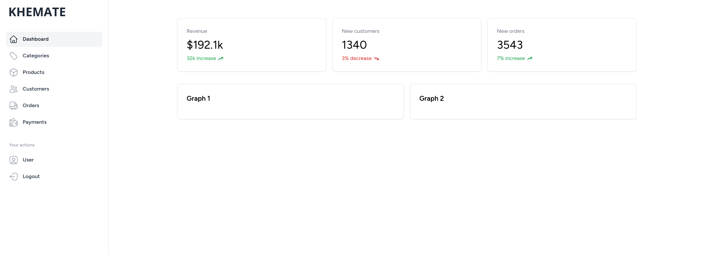

  

This project is a single vendor e-commerce web application developed as part of an academic project. It aims to create a platform for a single vendor to sell products online. The project utilizes the Laravel framework and incorporates essential features required for an e-commerce website.

---

## Technologies used

-   **[Laravel](https://laravel.com/)**
-   **[Tailwind CSS](https://tailwindcss.com/)**
-   **[Laravel Livewire](https://kirschbaumdevelopment.com)**
-   **[Alpine.js](https://alpinejs.dev/)**

---

### **SCREENSHOTS**

Homepage

Admin Dashboard

---

## Features

-   User Registration and Authentication
-   Updae user's personal information
-   Product catalog
-   Detailed product information
-   Shopping cart and checkout
-   Payment integration with stripe
-   Admin dashboard for category, product, order and user management
-   Responsive design for multi-device support
-   Generate invoices

## Future Recommendations

-   [ ] Implement authentication (with OAuth) via Facebook, Google, Twitter etc.
-   [ ] Allow users to upload profile pictures
-   [ ] Allow users change their password and delete account
-   [ ] Add multiple images of product (max: 4)
-   [ ] Add product colors and sizes
-   [ ] Implement product search
-   [ ] Implement product filtering
-   [ ] Introduce wishlists for users to save their favorite items
-   [ ] Implement user reviews and ratings for products
-   [ ] Enable discount coupons and promotional offers
-   [ ] Add order Management and Tracking
-   [ ] Add social sharing options to facilitate product sharing on social media platforms
-   [ ] Implement payment via e-sewa or khalti or any other payment method
-   [ ] Send order confirmation email

---

## Installation

Please check the official Laravel installation guide for server requirements before you start.

-   [Official Documentation](https://laravel.com/docs/10.x)

Clone this repository (or download the zip file and extract it)

    git@github.com:iambasanta/khemate.git

Change directory to the project directory

    cd khemate

Install composer dependencies

    composer install

Install npm dependencies

    npm install

Copy the example `.env.example` in `.env` file

    cp .env.example .env

Open and make the required configuration changes in the `.env` file

-   `DB_CONNECTION`
-   `DB_HOST`
-   `DB_PORT`
-   `DB_DATABASE`
-   `DB_USERNAME`
-   `DB_PASSWORD`

Generate an app encryption key

    php artisan key:generate

Run the database migrations (**Make sure the `.env` file is properly configured with your database credentials**)

    php artisan migrate

Seed the database (OPTIONAL)

    php artisan db:seed

Generates fake data using database `seeder` and `factories`

#### **Admin user credentials**

| Email             | Password |
| ----------------- | -------- |
| admin@khemate.com | password |

Start the local development server

    php artisan serve

Build the assets by running

    npm run dev

Or use [Laravel sail](https://laravel.com/docs/10.x/sail)

    ./vendor/bin/sail up -d

Now you can visit:

-   http://localhost:8000 (visitor)
-   http://localhost:8000/admin (admin)

on your web-broswer to access the website.
